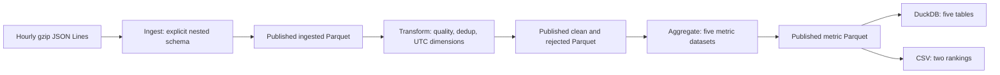

# GitHub Events Analytics with PySpark

A daily batch pipeline for [GH Archive](https://www.gharchive.org/) hourly GitHub
events. PySpark reads gzip JSON Lines, normalizes nested fields, validates and
deduplicates selected activity, then publishes eight date-partitioned Parquet
datasets. Five metric tables are exported to DuckDB and two rankings to CSV.

## Scope and requirements

The [DataSkew brief](https://dataskew.io/projects/batch-processing-spark/) requires
modular ingestion, transformation and aggregation, Docker/`spark-submit` execution,
date parameters and partitioned analytical outputs. Implemented extensions include
explicit schemas, autonomous unit/integration tests, deterministic event-ID dedup,
DuckDB, CSV, rejection metrics, bounded date loops, resource controls and interrupted
publication recovery. Scheduling, dashboards and a bot registry are outside scope.

Validation on 2026-10-02 covers **all 24 hourly archives for 2025-06-02 UTC**,
without truncation: 3,671,908 input events. Synthetic fixtures cover errors and
dedup cases absent from that real day. Input coverage is declared separately from
the event timestamp; selected hours do not establish a complete day.

## Architecture



| Component | Role | Input -> output |
| --- | --- | --- |
| `scripts/acquire_archive.py` | Declare hours, inspect/download and hash archives | GH Archive URLs -> gzip files and acquisition manifest |
| `jobs/ingest.py` | Normalize with an explicit nested schema | Local gzip files -> ingested Parquet |
| `jobs/transform.py` | Validate, deduplicate and derive UTC dimensions | Published ingested -> clean and rejected Parquet |
| `jobs/aggregate.py` | Compute daily metrics and rejection breakdown | Published clean/rejected -> five metric datasets |
| `jobs/pipeline.py` | Run the same stages, one date at a time | Local archives/checkpoints -> eight datasets |
| `jobs/export.py` | Validate and export published metrics | Parquet -> five DuckDB tables and two CSV rankings |
| `github_analytics/` | Reusable DataFrame logic, resource policy and storage protocol | Shared contracts used by thin jobs |
| `scripts/` and `tests/` | Independent oracles and autonomous verification | Generated fixtures or declared archives -> assertions and reports |

Every stage persists Parquet and the next stage reads that checkpoint. Aggregate
can restart without ingest/transform or access to the raw archives.

## Repository structure

```text
compose.yaml                 One-shot job and autonomous test services
docker/spark/Dockerfile       Immutable base digest and copied application source
requirements.txt             Pinned DuckDB dependency
setup.bat / setup.ps1         Windows bootstrap and its PowerShell implementation
setup.sh                     Bash bootstrap for macOS/Linux
github_analytics/             Reusable ingestion, transformation, metrics and storage
jobs/                         Thin pipeline, ingest, transform, aggregate, export CLIs
scripts/                      Job wrappers, acquisition, recovery and verification
tests/                        Autonomous generated-fixture tests
LICENSE                       MIT licence for this project's own code
```

`data/raw/`, `data/output/` and `data/test/` are generated, Git-ignored artifacts.
`.gitignore` and `.dockerignore` exclude data, caches, environments, credentials
and personal workflow configuration. Tests require no retained data or reports.

## Data contract and semantics

Input is one event per line (`multiLine=false`), matching GH Archive rather than
the brief's multiline example. The schema projects `id`, `type`, `created_at`,
`repo.name`, `actor.login`, `org.login`, `payload.action`, PR number (with
`payload.number` fallback for PR events), issue number and ordered issue-label
names. Extra payload fields are outside this contract.

Normalized records retain source timestamp text and `source_file`. IDs, type,
repository and actor are trimmed. Parsed timestamps use UTC. Clean records add
`event_timestamp` (timestamp), `event_hour` (integer 0-23), `is_bot` (boolean) and
`event_category` (string). All datasets have `event_date` (date), represented in
their partition path. Optional organization/payload fields may be null.

| Accepted type | Category |
| --- | --- |
| PushEvent | content |
| PullRequestEvent | collaboration |
| IssuesEvent | collaboration |
| WatchEvent | passive |

Quality precedence is: `corrupt_json`; missing/blank ID, type, repository or actor;
`invalid_timestamp`; `unsupported_event_type`; `outside_date`; then dedup on
quality-valid events. GH Archive groups by receipt hour: `outside_date` can be a
normal receipt-time/`created_at` boundary mismatch, not corrupt JSON. Rejected
records and their reason counts stay in the **requested processing date**.

Dedup keys are `(event_date, event_id)`. Native Spark `xxhash64` hashes the business
struct. For repeated IDs with equal hashes, exact JSON comparison preserves nulls,
ordered arrays, timestamp text and parsed timestamp: a hash collision never proves
equality. Different business contents reject **every copy** as
`conflicting_event_id`; identical contents retain the smallest source URI and
reject remaining copies as `duplicate_event_id`. Provenance and unprojected payload
fields are excluded from the conflict signature. Invalid copies keep their
earlier quality reason. Exact-row ties have indistinguishable projected contents.

`is_bot` is exclusively a case-insensitive `[bot]` **suffix** test. This captures
GitHub App naming and misses other bot names; it is not universal bot detection.

| Dataset / DuckDB table | Grain and values |
| --- | --- |
| `ingested` | Every projected input event and source URI; Parquet only |
| `clean` | One accepted ID per date; Parquet only |
| `rejected` | Every discarded occurrence, available ID/source URI, `corrupt_record` and reason; Parquet only |
| `daily_volume` | Date; `event_count` bigint |
| `event_counts` | Date, type, hour, bot flag; `event_count` bigint |
| `top_repositories` | Date/repository; bigint count and integer rank |
| `top_actors` | Date/actor; bigint count and integer rank |
| `rejection_counts` | Processing date/reason; `event_count` bigint |

Rankings default to ten entities per date, ordered by count descending then name
ascending. Counts measure events, not unique people. The five metric tables have
validated types and date-aware primary keys; only rankings are exported as CSV.
For each processed date, `ingested = clean + rejected` and the sum of
`rejection_counts.event_count` equals rejected rows. A zero-rejection date has no
reason rows; an empty rerun replaces all eight datasets with typed empty output.

**Traceability limit:** `rejection_counts` is aggregated. `rejected.source_file`
and `event_id`, when present, permit searching retained raw archives, but there is
no line number/offset or complete original JSON for valid JSON records. Missing
or repeated IDs prevent guaranteed mapping to one original occurrence. Keep raw
archives if investigation matters; normalized Parquet cannot reconstruct discarded
payload fields. No additional lineage feature is implemented.

## Prerequisites and setup

| Component | Tested runtime |
| --- | --- |
| Base | `spark:3.5.9-scala2.12-java17-python3-ubuntu@sha256:0fd2f57b122301c9fd02988ba8d7d68f03fa6f680ba092a9e6249c92610bd2ed` |
| Spark / Python | 3.5.9 / 3.10.12 |
| Java / Hadoop | 17.0.20.1 / 3.3.4 |
| DuckDB | 1.5.6, pinned in `requirements.txt` |
| Default execution | `local[2]`, UTC, Spark UI disabled |
| Identity | Windows default UID/GID `185:185` |

Install Git and Docker with Linux containers and Compose v2. Initial builds and
archive downloads need internet access. No host Python, Java, virtual environment,
credentials or cloud service is required. Reserve space for compressed input,
Parquet, exports, retained generations, images and oracle output/scratch: the
validated day alone has 2,215,022,601 compressed input bytes, not a total disk
requirement.

Windows PowerShell, from the desired parent directory:

```powershell
git clone https://github.com/Davideco89/batch-processing-spark.git
.\batch-processing-spark\setup.bat
Set-Location batch-processing-spark
```

macOS/Linux Bash instructions:

```bash
git clone https://github.com/Davideco89/batch-processing-spark.git
bash ./batch-processing-spark/setup.sh
cd batch-processing-spark
```

Setup validates Compose, builds, probes bind write access, runs autonomous tests
and verifies essential CLIs on fresh temporary input. It does not download data
or overwrite existing outputs. Repeat setup to rebuild copied source and recheck.
The PowerShell execution-policy override is process-scoped, not persistent.
`setup.bat` delegates to the sibling `setup.ps1` and returns a nonzero exit code
when setup fails. PowerShell can also be invoked directly:
`powershell.exe -NoProfile -ExecutionPolicy Bypass -File .\setup.ps1` from the
repository root. All setup entrypoints resolve the repository from their own
location, including paths with spaces; job wrappers remain under `scripts/`.

Bash creates an ignored `.env` only when absent, with a non-root host
`LOCAL_UID`/`LOCAL_GID`. `.env.example` documents these optional values; existing
files are preserved. The image registers the matching Spark account. Rebuild
after changing identity; setup does not change ownership of old data. A successful
root-directory probe does not certify older subdirectories.

Tested: Windows PowerShell, Docker Desktop Linux/amd64 on Windows/WSL2, and Ubuntu
WSL Bash with a verification-only bridge to the Windows Docker CLI. The latter
exercised the public Bash wrapper but does not certify a native Linux/macOS Docker
host. ARM, standalone clusters, native Windows Spark, object/network storage and
host/VM power loss are untested. The older isolated ext4 evidence has placeholders
in some recorded invocations; those exact commands were not retroactively invented.

## Run the pipeline

Compose mounts `./data:/data`; files persist after the container exits. Source is
copied into the image, so rebuild after changes:

```powershell
docker compose build
docker compose run --rm test
```

These single-line Docker commands also work in Bash. Default raw is
`/data/raw/gharchive`; default Parquet is `/data/output/parquet/github-events`;
default DuckDB and CSV are `/data/output/duckdb/github-events.duckdb` and
`/data/output/csv/github-events`. Destination defaults are independent. The
examples below use a separate published root to preserve older direct-write data.

Declare coverage and inspect sizes **before downloading**:

```powershell
docker compose run --rm --entrypoint python3 job /app/scripts/acquire_archive.py --date 2025-06-02 --hours 0 1 2 3 4 5 6 7 8 9 10 11 12 13 14 15 16 17 18 19 20 21 22 23 --head-only --manifest /data/test/gharchive/2025-06-02/plan.json
# Inspect the plan and free disk space before acquisition.
docker compose run --rm --entrypoint python3 job /app/scripts/acquire_archive.py --date 2025-06-02 --hours 0 1 2 3 4 5 6 7 8 9 10 11 12 13 14 15 16 17 18 19 20 21 22 23 --plan /data/test/gharchive/2025-06-02/plan.json --manifest /data/test/gharchive/2025-06-02/acquisition.json
docker compose run --rm job --driver-memory 2g /app/jobs/pipeline.py --date 2025-06-02 --output-root /data/output/parquet/github-events-published
docker compose run --rm --entrypoint python3 job /app/jobs/export.py --date 2025-06-02 --parquet-root /data/output/parquet/github-events-published --database /data/output/duckdb/github-events-published.duckdb --csv-root /data/output/csv/github-events-published
```

Acquisition has 128 MiB/file and 3 GiB/total default limits; it records actual
sizes/SHA256 and reuses completed size-matching files. Partial transfers restart.
A size check alone does not authenticate remote contents. Jobs read all matching
local files without downloading or enforcing 24-hour coverage; inspect the
acquisition manifest and verify its hashes before interpreting full-day totals.
The 2026-10-02 validation reused existing archives and downloaded none.

Public stage wrappers invoke Docker and `spark-submit`. Bash:

```bash
./scripts/run_job.sh ingest --date=2025-06-02 --output-root=/data/output/parquet/github-events-published
./scripts/run_job.sh transform --date=2025-06-02 --output-root=/data/output/parquet/github-events-published
./scripts/run_job.sh aggregate --date=2025-06-02 --output-root=/data/output/parquet/github-events-published
```

PowerShell equivalents:

```powershell
.\scripts\run_job.ps1 ingest --date=2025-06-02 --output-root=/data/output/parquet/github-events-published
.\scripts\run_job.ps1 transform --date=2025-06-02 --output-root=/data/output/parquet/github-events-published
.\scripts\run_job.ps1 aggregate --date=2025-06-02 --output-root=/data/output/parquet/github-events-published
```

Use process-scoped `powershell.exe -NoProfile -ExecutionPolicy Bypass -File`
if the local policy blocks script execution. Direct Docker entrypoints remain
available. `--raw-root`, `--output-root` and positive `--top-n` apply to the jobs.
The exporter supports `--mode both|duckdb|csv` and the three destination overrides
shown above; it exports one date per invocation.

Date ranges are inclusive and sequential. Supply either `--date` or both
`--start-date` and `--end-date`; invalid/reversed/mixed dates fail before Spark.
The first failing date stops the loop. Resume explicitly after inspection:

```powershell
.\scripts\run_job.ps1 pipeline --start-date=2025-06-01 --end-date=2025-06-03 --resume-date=2025-06-02 --from-stage=aggregate --output-root=/data/output/parquet/github-events-published
```

This resumes aggregate on June2, then executes the full chain on June3. Individual
stage jobs run their chosen stage for each selected date. Aggregate requires both
clean and rejected checkpoints; transform requires ingested. Recover interrupted
publication first as described below. Range fixtures and recovery were tested;
the example range requires its own local inputs/checkpoints.

### Resources, shuffle and layout

The launcher validates `--master`, `--driver-memory`, `--executor-memory`,
`--executor-cores`, `--total-executor-cores` and repeatable `--conf key=value` before
the driver starts. Dedicated resource flags override matching `--conf`, then
`SPARK_MASTER`, `SPARK_DRIVER_MEMORY`, `SPARK_EXECUTOR_MEMORY`,
`SPARK_EXECUTOR_CORES`, `SPARK_TOTAL_EXECUTOR_CORES`, then defaults. It is a defined
subset of `spark-submit`, not forwarding every native option.

```powershell
docker compose run --rm job --master 'local[4]' --driver-memory 768m --executor-memory 768m --conf spark.sql.shuffle.partitions=8 /app/jobs/pipeline.py --date 2025-06-02 --output-root /data/output/parquet/github-events-published
```

This resource form was tested on small range fixtures, not as a recommendation
for the full day. Local mode has no separately allocated executor JVM: requesting
768m produced a 768 MiB driver heap while its effective executor context remained
1g. Cluster resource allocation has not been verified.

Shuffle precedence is application `--shuffle-partitions`, launcher
`--conf spark.sql.shuffle.partitions=N` (or `SPARK_SHUFFLE_PARTITIONS` if absent),
distinguishable session override, then per-stage footer-volume policy. A session
override equal to the last automatic value is ambiguous; prefer explicit CLI
flags. Automatic count is `max(2, ceil(estimated_bytes / target_bytes))`, default
target 128 MiB; `--shuffle-target-bytes` changes the positive target. Transform
uses ingested Parquet footer uncompressed column bytes; aggregate uses clean plus
rejected. Ingest reports compressed gzip bytes without a shuffle-volume estimate.

`StageSettings` records inputs, estimate, actual shuffle, heap/master and AQE.
Footer bytes are a **proxy**, distinct from gzip size, memory and compressed
shuffle transport. AQE is preserved; its observed advisory target was 64 MiB,
separate from the 128 MiB initial-policy target. Neither guarantees task sizes.
Hourly gzip files stay separate and nonsplittable; `local[2]` runs two tasks at a
time. Increasing cores or selecting a real master does not certify cluster
publication: this local filesystem protocol requires shared paths visible to
driver and workers. No cosmetic `repartition`/`coalesce` was added.

## Published storage, recovery and reproducibility

Publication is per dataset/date, with an exclusive writer/recovery lock:

1. Write staging under `dataset/_transactions/YYYY-MM-DD/stage` on the same
   filesystem. Validate schema, row count, `_SUCCESS` and file inventory/SHA256.
2. Rename the completed directory to
   `dataset/event_date=YYYY-MM-DD/_generations/<uuid>`; generations are immutable.
3. Atomically replace the small `_publication.json` pointer with `os.replace`,
   then remove the transaction journal. Old generations are retained.

First publication creates the first pointer. Replacement creates a new generation
and changes the pointer, **not delete-plus-rename of a nonempty directory**. Empty
dates publish schema-carrying empty Parquet generations. This is not a transaction
across eight datasets or across Parquet, DuckDB and CSV. DuckDB replaces five
tables for the date in its own transaction; CSV replacement is per file.

Normal consumers resolve the pointer and validate journal absence, manifest,
completion, inventory and content hashes. Use `github_analytics.storage.read_date`
or `read_dates`, the exporter and supplied verifiers. A dataset-root Parquet glob
bypasses these gates and is not a supported reader. A lazy Spark reader retains
the resolved immutable generation, so old generations must not be deleted while
readers may still use them.

After an interrupted writer, readers fail closed even if the new pointer already
exists. Stop the writer and inspect its date before recovery:

```powershell
docker compose run --rm --entrypoint python3 job /app/scripts/recover_partition.py --dataset-root /data/output/parquet/github-events-published/daily_volume --date 2025-06-02 --action inspect
docker compose run --rm --entrypoint python3 job /app/scripts/recover_partition.py --dataset-root /data/output/parquet/github-events-published/daily_volume --date 2025-06-02 --action rollback
```

Inspect fails on incomplete publication; preserve the error/journal for diagnosis.
Rollback retains the previous complete pointer before publication, or removes
unready staging if no prior output exists. If pointer replacement already
committed, recovery completes cleanup instead of undoing it. Explicit `--action
commit` accepts only a validated prepared generation. Corrupt or ambiguous
metadata fails rather than being guessed. Recovery cannot take an active writer's
lock. Recover each affected dataset/date, restart the required stage and reexport
before consumption. Tests include recovery followed by aggregate without raw.

Legacy direct-write partitions are rejected and left intact. Regenerate retained
raw into an unused published output root; no automatic import/attestation exists.
`compare_legacy.py` is an explicit **read-only diagnostic** comparing seven legacy
schemas/full-row multisets to current publication. It bypasses the gate only for
that restricted legacy comparison and never certifies legacy data as published.
The old single-archive `compare_layout.py` CLI is retired in favor of this tool
and `validate_parquet.py`.

Streaming hash checks and footer discovery add I/O; retained generations consume
disk. Safe garbage collection, automatic retry, concurrent writers, coordinated
rollback/backup, scheduler and CI are not implemented. Do not manually delete
locks, journals or generations during active reads/writes. Same-date reruns
replace only that date, preserve other dates and retain logical rows for unchanged
input; compare full rows/types, not filenames or physical Parquet bytes.

## Validation and observed results

| Check | Command or query | Observed result | Date / environment |
| --- | --- | --- | --- |
| Complete autonomous suite | `docker compose run --rm test` | 46 tests, 366.833 s, OK; no downloads/inherited output | 2026-10-02, Windows/WSL2 Linux Docker |
| Fresh public clone with candidate source overlay (historical setup path) | `scripts/setup.ps1` | Build, identity/write probe, 41 then-current tests and fresh pipeline/export/verifier passed; final two helper/test files checked separately | 2026-10-02, Windows PowerShell; candidate changes not yet published |
| Public wrappers and stage restart | Bash ingest; PowerShell transform/aggregate | Fixture 13 = 8 clean + 5 rejected; later stages used absent raw paths | 2026-10-02, Windows/Ubuntu WSL bridge |
| Range, failure/resume, empty and other dates | `check_batch_scaling.py --skip-volume` on isolated generated input | Invalid dates/resources rejected; failed middle date stopped loop; explicit resume passed; eight typed empties, coherent empty SQL/CSV, 116 other-date file hashes unchanged | 2026-10-02, actual Windows bind |
| Storage fault matrix | `tests.test_storage` and `tests.test_publication` with bind-backed `TMPDIR` | 7 tests OK; 33 publication fault scenarios for first/replacement/empty dates | 2026-10-02, actual Windows bind |
| Real process interruption | Isolated writer killed during nonempty temporary files and after pointer replacement | Exit137, no OOM; seven consumers rejected both interrupted outputs; recovery/restart/export passed, 50 other-date files unchanged | 2026-10-02, actual Windows bind |
| Actual read-only bind | Normal Spark readers and read-only DuckDB query | All eight real-day counts and five tables readable; attempted bind write failed errno30 | 2026-10-02, final candidate |
| Historical real-day regression | `compare_legacy.py` | Seven schemas and complete row multisets matched without source-URI rewriting or legacy attestation | 2026-10-02, preserved original baseline |
| Independent real-day validation | `stream_oracle.py` + `validate_parquet.py` | Eight schemas/full-row multisets matched raw oracle and native shuffle 8; all 24 archive hashes/coverage verified | 2026-10-02, full day |
| Analytical exports | `verify_exports.py` | Five SQL table types/full rows and two CSV headers/ordered contents matched published metrics | 2026-10-02, full day |

Final runtime attribution is retained locally: the 46-test candidate differs from
the real-day image only in the bounded sample profiler and its new tests; all
pipeline/business/schema code is identical. An actual fixture profiler run and
read-only real consumers also passed on the final image. Earlier suite/clone
results are not retroactively attributed to the final image.

Run the fresh autonomous CLI check independently:

```powershell
docker compose run --rm --entrypoint python3 job /app/scripts/check_reproducibility.py
```

For a complete day, the independent oracle streams raw events with disk-backed
SQLite grouping and bounded caches/batched transactions. Random-I/O scratch uses
container `/tmp`; complete expected rows and hashes persist at the destination.
Spark compares every field and multiplicity with bidirectional `exceptAll`,
without collecting the day into Python:

```powershell
docker compose run --rm --entrypoint python3 job /app/scripts/stream_oracle.py --date 2025-06-02 --destination /data/test/real-validation/2025-06-02/oracle
docker compose run --rm job --driver-memory 2g --conf spark.sql.shuffle.partitions=8 /app/scripts/validate_parquet.py --date 2025-06-02 --output-root /data/output/parquet/github-events-published --oracle /data/test/real-validation/2025-06-02/oracle --manifest /data/test/gharchive/2025-06-02/acquisition.json --report /data/test/real-validation/2025-06-02/parquet.json
docker compose run --rm --entrypoint python3 job /app/scripts/verify_exports.py --date 2025-06-02 --parquet-root /data/output/parquet/github-events-published --database /data/output/duckdb/github-events-published.duckdb --csv-root /data/output/csv/github-events-published --report /data/test/real-validation/2025-06-02/exports.json
```

Retain a separate published baseline and use `validate_parquet.py --compare-root`
for rerun/full-row equality. Reexport, then `verify_exports.py --compare
<previous-report.json>` checks SQL rows/types and CSV bytes, including other dates.
`profile_archive.py` is only a small-sample diagnostic: default limits are 200,000
raw/frame rows and 128 MiB original uncompressed input/serialized frame bytes.
It refuses larger samples before driver materialization. These caps are not a
memory guarantee; use the streaming oracle for full days.

### Real-day counts and layout

Source: `https://data.gharchive.org/2025-06-02-{hour}.json.gz`, all hours 0-23.
The 24 retained archives total 2,215,022,601 compressed bytes. Complete input
reconciliation is **3,671,908 = 2,673,289 accepted + 998,619 rejected**, all
`unsupported_event_type`. No real quality-invalid rows, identical duplicates or
conflicting IDs were observed; generated tests cover those cases, including forced
hash collisions, UTC/offset boundaries, multiple defects and bot suffix cases.

| Dataset | Rows | Automatic Parquet files / bytes |
| --- | ---: | ---: |
| ingested | 3,671,908 | 24 / 116,595,191 |
| clean | 2,673,289 | 2 / 102,783,152 |
| rejected | 998,619 | 3 / 36,004,131 |
| event_counts | 168 | 1 / 2,377 |
| daily_volume | 1 | 1 / 499 |
| top_repositories | 10 | 1 / 1,405 |
| top_actors | 10 | 1 / 1,274 |
| rejection_counts | 1 | 1 / 895 |

The transform footer proxy was 185,568,399 bytes and selected 2; aggregate's proxy
was 257,768,512 bytes and selected 2. Explicit shuffle 8 produced eight clean files
/115,380,062 bytes, matching the historical eight-file physical-size baseline;
all logical rows match automatic 2 exactly. No extra layout shuffle was introduced.

Real automatic-chain event logs contain 209 tasks and 37 final AQE plans;
the explicit 8 transform/aggregate restart has 154 tasks and 33 final AQE plans.
Largest observed compressed task shuffle reads were 106,177,612 and 27,657,411
bytes respectively; shuffle writes were 103,179,894 and 107,531,442 bytes.
Both show coalesced AQE reads and conditional exact-JSON hash fallback. The second
run excludes ingest, and CPU/resource contention differed: these are observations,
not a controlled speed comparison or a guarantee for larger days.

The retained synthetic dedup benchmark used the same 150,000-row input/runtime,
warmup excluded and three measurements. Native hash reduced CPU/shuffle bytes,
but median wall time at shuffle 8 increased **36.8%**; at shuffle 2 it decreased
13.3%. There is no universal acceleration claim or real week/month forecast.

### Inspect five rejection rows in the terminal

PowerShell, after the export above:

```powershell
@'
import duckdb
with duckdb.connect("/data/output/duckdb/github-events-published.duckdb", read_only=True) as db:
    print("Tables:", db.execute("SHOW TABLES").fetchall())
    print("Schema:", db.execute("DESCRIBE rejection_counts").fetchall())
    print("First five:", db.execute("SELECT * FROM rejection_counts ORDER BY event_date, rejection_reason LIMIT 5").fetchall())
'@ | docker compose run --rm -T --entrypoint python3 job -
```

Bash equivalent:

```bash
docker compose run --rm -T --entrypoint python3 job - <<'PY'
import duckdb
with duckdb.connect("/data/output/duckdb/github-events-published.duckdb", read_only=True) as db:
    print(db.execute("SELECT * FROM rejection_counts ORDER BY event_date, rejection_reason LIMIT 5").fetchall())
PY
```

For the verified day the result has **one** row: date 2025-06-02,
`unsupported_event_type`, count 998619. `LIMIT 5` returns at most five existing
reason/date groups, not five rejected messages. Use the published `rejected`
dataset for projected occurrences and retained raw for source investigation.

## Implementation decisions and deviations

| Brief or reference | Choice | Reason / trade-off | Verification |
| --- | --- | --- | --- |
| Multiline JSON example | Explicit nested schema, JSON Lines | GH Archive is one event per line; unprojected payload is not recoverable | Complete raw/oracle reconciliation and nested fixtures |
| Bash/YAML execution examples | Bash and PowerShell wrappers, Compose, validated CLI | No host Python/Java; no extra configuration layer | Actual public wrapper stages and fresh checkout setup |
| Scale across dates | Sequential daily loop, explicit resume/resources | Preserves hourly gzip and checkpoint boundaries; no cluster certification | Three-date failure/resume fixture and full-day run |
| Volume-based shuffle | Footer proxy with explicit override and actual settings/plans | Additional footer I/O; approximate 128 MiB initial target | Volume fixtures retained, real 2/8 exact comparison and event logs |
| Business dedup hash | Native hash plus exact candidate fallback | Hash equality is insufficient; no UDF or all-row JSON fallback | Collision fixtures, old/new benchmark and full-day oracle |
| Complete date publication | Same-filesystem generation rename plus atomic pointer | Retained generations and explicit recovery; no pipeline transaction | Bind faults, real process kills, gated consumers and recovery |
| Optional schema/tests/SQL/CSV | Adopted with explicit grains and reconciliations | Additional maintenance; aggregated rejects are not lineage | 46 tests, eight-schema oracle, five-table/two-CSV checks |

## Known limitations and operations

Two historical Windows-bind `PermissionError: [Errno 13]` failures occurred while
renaming a `daily_volume` generation in nested test harnesses. Their **cause
remains indeterminate**. Three isolated public CLI repetitions (48 first
publications) and one fresh nested-harness run passed, but do not resolve the
original failures or prove absence. Failed trees/logs are preserved. No speculative
retry, GC or storage patch was added; readers fail closed and explicit recovery
is required. Path-length probes and later passes do not prove MAX_PATH or JVM/GC
causation. This is an open operational risk on the tested bind.

Crash evidence demonstrates process interruption on the tested filesystem;
`fsync` requests do not establish host/VM power-loss durability. Hash/discovery
I/O, retained-generation disk cost and single-writer constraints remain. No
coordinated transaction covers pipeline or exports.

GH Archive upstream completeness, receipt latency, changes to completed remote
objects and activity beyond selected hours are not established. Unsupported
malformed shapes are not silently certified by the oracle. Traceability, payload
projection, bot heuristic, resource-allocation and platform limits above apply.
Logs contain runtime/stage counts; acquisition/verifiers write selected reports.
Keep exact commands, coverage and baselines when operating. No scheduler, CI,
automatic retry, coordinated backup or retention automation is present.

Exact local validation commands, failures/corrections, images/source hashes,
schema reports, ADR matrix and draft submission are retained under ignored
`data/test/integrated-validation/2026-10-02/`. These are evidence, not dependencies
of a clean clone. The final candidate requires independent/human review and
publication approval; checkpoint feedback is not a grade or final submission.

## Troubleshooting

| Symptom | Verified cause or behavior | Remedy / action | Verification |
| --- | --- | --- | --- |
| Reader reports interrupted publication | Journal/residual staging causes fail-closed discovery, including after pointer replacement | Stop writer, inspect, explicitly recover the affected date, restart and reexport | Bind fault matrix and real SIGKILL recovery with other dates intact |
| SQLite raw oracle stalls on a Windows bind | Two historical bind-scratch attempts were stopped; container random-I/O scratch completed | Use current `stream_oracle.py`, which keeps SQLite in `/tmp` and persists reports/expected rows on `/data` | Complete 24-hour oracle matched all eight datasets |
| Old image reports shuffle 2 despite explicit 8 | Historical session code overrode launcher; source is copied into images | Rebuild; run `check_reproducibility.py` before relying on changed configuration | Fresh-process override and real native8 matched automatic 2 |
| Small-sample profiler refuses input | Declared row/byte limit exceeded before materializing whole frames | Use `stream_oracle.py` and `validate_parquet.py` for full-day verification | Overflow tests and guarded native fixture profile passed |

## Credits and licence

Own code and documentation use [MIT](LICENSE). This does not license downloaded
archives, event datasets, third-party content or runtime assets. GH Archive's
code licence does not establish MIT rights over underlying GitHub events; no
ownership of that dataset is claimed.

Exercise: [DataSkew](https://dataskew.io/projects/batch-processing-spark/).
Data: [GH Archive](https://www.gharchive.org/).
Runtime: [Apache Spark](https://spark.apache.org/) and [DuckDB](https://duckdb.org/),
under their respective licences. Resource/SQL behavior was checked against the
[Spark 3.5.9 documentation](https://spark.apache.org/docs/3.5.9/).
