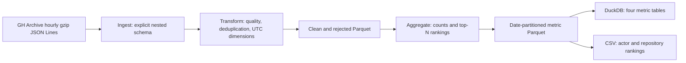

# GitHub Events Analytics with PySpark

A date-parameterized batch pipeline for [GH Archive](https://www.gharchive.org/)
hourly GitHub events. It reads gzip JSON Lines, normalizes nested fields, validates
and deduplicates selected activity, and produces date-partitioned Parquet,
embedded DuckDB tables, and CSV rankings.

## Scope and requirements

This implements the [DataSkew batch processing brief](https://dataskew.io/projects/batch-processing-spark/):
modular ingestion, transformation and aggregation jobs in Docker, date-parameterized
execution as a chain or separate stages, and partitioned Parquet metrics with
repeatable results. Explicit schema validation, autonomous tests, event-ID
deduplication, DuckDB exports, and CSV summaries are adopted extensions.
The latest local validation covers **all 24 hourly archives for 2025-06-02 UTC**;
2025-06-01 covers only 00:00–01:00 UTC. Neither dataset represents GitHub activity
outside its declared input coverage. Scheduling and dashboards are outside scope.

## Architecture



Jobs are thin entrypoints. Reusable Spark logic lives in `github_analytics/`.
The complete chain persists each stage; `ingest.py`, `transform.py`, and
`aggregate.py` can also run independently, in that order.

| Component | Role | Input → output |
| --- | --- | --- |
| `scripts/acquire_archive.py` | Declare coverage, acquire and hash archives | GH Archive URLs → local gzip files and manifest |
| `jobs/ingest.py` | Read explicit schema and normalize nested fields | Local gzip JSON Lines → ingested Parquet |
| `jobs/transform.py` | Apply quality rules, deduplication and UTC dimensions | Ingested Parquet → clean and rejected Parquet |
| `jobs/aggregate.py` | Compute daily volume, grouped counts and rankings | Clean Parquet → four metric datasets |
| `jobs/pipeline.py` | Execute the same three stages in order | Local archives → all seven Parquet datasets |
| `jobs/export.py` | Validate and export existing metrics | Metric Parquet → DuckDB tables and ranking CSV |
| Verification scripts and tests | Check contracts and reconciliations | Generated fixtures or declared real input → assertions and reports |

## Repository structure

```text
compose.yaml                 One-shot job and autonomous test services
docker/spark/Dockerfile       Pinned-version Spark runtime and copied source
requirements.txt             DuckDB dependency
github_analytics/            Ingestion, transformation, aggregation, storage, exports
jobs/                        pipeline.py, ingest.py, transform.py, aggregate.py, export.py
scripts/                     Acquisition, independent oracles, comparisons, verification
tests/                       Generated fixtures and autonomous unit/integration tests
LICENSE                      MIT licence for this project's own code
```

Generated inputs, outputs and evidence are separate from source: `data/raw/`,
`data/output/` and `data/test/` are ignored by Git. Their functional paths are
listed below; real data and prior reports are not required to run the tests.

## Data contract

Input is one event per line. The explicit schema extracts `id`, `type`,
`created_at`, `repo.name`, `actor.login`, `org.login`, `payload.action`,
`payload.pull_request.number` (falling back to `payload.number` for PR events),
`payload.issue.number`, and ordered `payload.issue.labels[].name`.
Additional payload fields are outside the projected contract.

Normalized outputs retain `source_file`, source timestamp text, IDs, names,
action, nested numbers, and label arrays. Parsed timestamps use UTC;
`event_date` is a date partition, and `event_hour` is 0–23. Ingested and rejected
records preserve `corrupt_record`; rejected records also contain a reason.
Clean data adds `event_timestamp`, `event_hour`, `is_bot`, and `event_category`.

| Accepted type | Category |
| --- | --- |
| PushEvent | content |
| PullRequestEvent | collaboration |
| IssuesEvent | collaboration |
| WatchEvent | passive |

An actor is a bot when its login, converted to lowercase, ends with `[bot]`.
This is a naming heuristic. Optional organization/payload fields may be null.
Quality reasons have this precedence: corrupt JSON; missing/blank event ID,
event type, repository, or actor; invalid timestamp; unsupported event type;
UTC timestamp outside the requested date. Identity fields are trimmed.

Deduplication applies only to quality-valid events, keyed by date and event ID.
Identical normalized business contents retain the copy with the smallest source
URI; remaining copies receive `duplicate_event_id`. Different contents reject
**all** copies with `conflicting_event_id`. Business contents include the source
timestamp text, parsed timestamp, ordered labels, and all normalized business
fields; source provenance and unprojected payload fields are excluded from the
conflict signature. Invalid copies retain their earlier quality reason.

| Dataset / DuckDB table | Grain and values |
| --- | --- |
| ingested | Every input event, normalized fields and provenance; Parquet only |
| clean | One accepted event ID per date; Parquet only |
| rejected | Every discarded event with reason; Parquet only |
| daily_volume | Date; `event_count` (bigint) |
| event_counts | Date, type, hour, bot flag; `event_count` (bigint) |
| top_repositories | Date and repository; count and integer rank |
| top_actors | Date and actor; count and integer rank |

Rankings default to 10 rows per date and sort by count descending, then entity
name ascending. They count events, not unique contributors. CSV exports contain
only the two ranking datasets, with headers and rank order. DuckDB exports all
four metrics, with date-aware primary keys and validated schemas.

## Runtime

| Component | Version or configuration used |
| --- | --- |
| Spark base image | `spark:3.5.9-scala2.12-java17-python3-ubuntu` |
| Python / PySpark | 3.10 / 3.5.9, supplied by the image |
| Java | 17; 17.0.20.1 observed in job logs |
| Py4J | Bundled with Spark, not independently installed |
| DuckDB | 1.5.6, pinned in `requirements.txt` |
| Spark execution | `local[2]`, UTC, Spark UI disabled |
| SQL shuffle partitions | Default 2; validated full-day override 8 |

The Dockerfile checks Python/PySpark/DuckDB versions. The image uses a version tag, not an
immutable registry digest. Spark runs `local[2]`, with UTC and no Spark UI.
The default SQL shuffle count is 2; explicit launcher `--conf` overrides it.

## Prerequisites and setup

### Prerequisites

- Git to obtain and inspect the source repository.
- Docker Desktop using Linux containers, with Docker Compose v2 (`docker compose`).
- Internet access for the initial image/dependency build and for GH Archive downloads.
- Space for compressed input, generated Parquet/exports, Docker images and scratch,
  and any retained verification rows or comparison snapshots. The validated day
  required 2,215,022,601 compressed input bytes; this is an observation, not a
  minimum disk requirement. Inspect the acquisition plan and available space
  before downloading, and allow for additional verification copies.

No host Python, Java, virtual environment, credentials, or cloud service is needed.
The tested environment is Windows PowerShell with Linux containers on Windows/WSL2.
Docker Desktop and Compose host versions are not pinned; native macOS/Linux hosts
have not been tested.
The setup scripts were exercised from Windows PowerShell and Ubuntu WSL Bash
against Docker Desktop (Bash used a verification-only Windows CLI path bridge
because distro integration was disabled). Linux filesystem permissions were
checked separately on an isolated container volume. This is not evidence of
a native macOS/Linux Docker installation or a remote clone.

### Getting started from an existing checkout

There is no published repository URL or verified fresh-clone procedure yet.
Start from the existing project checkout; no remote URL is invented here.
From its parent directory, Windows PowerShell:

```powershell
.\batch-processing-spark\scripts\setup.ps1
```

From any directory, macOS/Linux Bash (adjust the checkout path):

```bash
bash /path/to/batch-processing-spark/scripts/setup.sh
```

Both scripts locate the repository, validate Compose, build the runtime, probe
write access to the data bind, run autonomous tests, and verify the essential
pipeline/export CLIs using generated temporary input. They do not download
archives or overwrite existing datasets. Setup is safe to repeat; each run
rebuilds and reruns these checks. No persistent container is created.

On Unix hosts, Bash creates an ignored `.env` only if absent, using the current
non-root host `LOCAL_UID`/`LOCAL_GID`. These Compose values also register the
matching Spark account during the image build, so Java can resolve its identity.
Windows defaults remain `185:185`; PowerShell does not create `.env`.
`.env.example` documents the two optional values. Existing `.env` files are
never rewritten; shell overrides are supported. Rebuild after changing identity
values. Setup does not change permissions or ownership of existing data; a
successful root-directory probe does not certify ownership of older subdirectories.

For manual build and tests, from the checkout's parent directory:

```powershell
Set-Location batch-processing-spark
docker compose build
docker compose run --rm test
```

The equivalent setup for macOS/Linux Bash is documented, but untested on those hosts:

```bash
cd batch-processing-spark
docker compose build
docker compose run --rm test
```

These commands build the copied-source runtime and run autonomous fixture tests.
Then declare and acquire the desired real input and execute the jobs below.
Job configuration uses non-secret CLI flags. An ignored `.env` is optional for
the Docker runtime identity; no credentials are required.

### Input and output paths

| Purpose | Container path | Host path |
| --- | --- | --- |
| Real archives | `/data/raw/gharchive` | `data/raw/gharchive/` |
| Parquet | `/data/output/parquet/github-events` | `data/output/parquet/github-events/` |
| DuckDB | `/data/output/duckdb/github-events.duckdb` | `data/output/duckdb/github-events.duckdb` |
| CSV | `/data/output/csv/github-events` | `data/output/csv/github-events/` |
| Verification, logs, temporary experiments | `/data/test` | `data/test/` |

Compose mounts `./data:/data` for the job service. Data survives container exit;
`run --rm` removes the finished container, so it disappears from Docker Desktop.
Container `/tmp` scratch disappears too. Source is copied into images: rebuild
when code changes. Tests generate data in temporary directories and do not mount
or require the host data. `.gitignore` and `.dockerignore` exclude generated data,
caches, environments, secrets, and personal workflow configuration. Earlier
local commits still contain that configuration; the public history is pending.

## Run the pipeline

### Windows PowerShell

These command forms were tested from Windows PowerShell with Linux containers.
The full-day execution used a 2 GiB driver and 8 shuffle partitions.

```powershell
docker compose build
docker compose run --rm test
```

Inspect the selected source sizes **before downloading**. The acquisition helper
requires ordered, unique hours, defaults to a 128 MiB limit per file and a 3 GiB
total limit, records URLs/actual sizes/SHA256, and reuses completed size-matching
files. Interrupted partial transfers restart; completed hours do not redownload.
The manifest provides the observed content hashes; a size check alone is not a
remote content-authenticity guarantee.

```powershell
docker compose run --rm --entrypoint python3 job /app/scripts/acquire_archive.py --date 2025-06-02 --hours 0 1 2 3 4 5 6 7 8 9 10 11 12 13 14 15 16 17 18 19 20 21 22 23 --head-only --manifest /data/test/gharchive/2025-06-02/plan.json
# Inspect plan.json and available disk space, then acquire the declared full hours.
docker compose run --rm --entrypoint python3 job /app/scripts/acquire_archive.py --date 2025-06-02 --hours 0 1 2 3 4 5 6 7 8 9 10 11 12 13 14 15 16 17 18 19 20 21 22 23 --plan /data/test/gharchive/2025-06-02/plan.json --manifest /data/test/gharchive/2025-06-02/acquisition.json
docker compose run --rm job --driver-memory 2g --conf spark.sql.shuffle.partitions=8 /app/jobs/pipeline.py --date 2025-06-02
docker compose run --rm --entrypoint python3 job /app/jobs/export.py --date 2025-06-02
```

The acquisition CLI without arguments selects only June1 hour00. The Spark job
requires `--date` and reads all matching files already in its raw root; it does
not download files or enforce a 24-hour day. Verify the manifest/file inventory
before interpreting a metric as a full-day result.

The separately validated full-day stage commands below use an isolated output
root and the exact observed launcher flags (the original runs effectively used 2
before the session fix described below). Stages support `--raw-root`,
`--output-root`, and `--top-n` (positive integer):

```powershell
docker compose run --rm job --driver-memory 2g --conf spark.sql.shuffle.partitions=8 /app/jobs/ingest.py --date 2025-06-02 --output-root /data/test/github-events/2025-06-02/day/separate/parquet
docker compose run --rm job --driver-memory 2g --conf spark.sql.shuffle.partitions=8 /app/jobs/transform.py --date 2025-06-02 --output-root /data/test/github-events/2025-06-02/day/separate/parquet
docker compose run --rm job --driver-memory 2g --conf spark.sql.shuffle.partitions=8 /app/jobs/aggregate.py --date 2025-06-02 --output-root /data/test/github-events/2025-06-02/day/separate/parquet
```

Exporter `--mode` is `both` by default, or `csv`/`duckdb`. It supports
`--parquet-root`, `--csv-root`, and `--database`; destination defaults are
independent, so supply destination overrides when using a separate test dataset.

### macOS / Linux Bash

Use the same single-line Compose commands above from the project root in Bash.
No PowerShell-specific syntax is needed in those invocations. Native macOS and
Linux hosts were **not** tested; Linux container execution on Windows was tested.
No fresh Git clone, remote repository, CI run, or native-host guarantee is claimed.

## Validation and observed results

The final Docker suite passed all 22 tests in 81.234 seconds. It generates
malformed/valid/nested events, duplicates and
conflicts, checks timestamps, metric grains/ranks, empty reruns, date preservation,
exports and schema rejection. Tests never download archives or call external APIs.
A separate fresh-state check runs essential CLIs against self-generated temporary
input and asserts that launcher shuffle overrides are honored:

```powershell
docker compose run --rm --entrypoint python3 job /app/scripts/check_reproducibility.py
```

For a complete real-data check, the independent oracle streams all raw events and
uses disk-backed SQLite grouping with bounded caches and batched transactions.
Disposable random-I/O scratch lives inside the container, avoiding Windows-bind
SQLite overhead. Complete expected rows and the source-hash report persist on
`/data/test`; Spark compares every field and multiplicity in both directions with
`exceptAll`, rather than collecting millions of rows in Python.

```powershell
docker compose run --rm --entrypoint python3 job /app/scripts/stream_oracle.py --date 2025-06-02 --destination /data/test/github-events/2025-06-02/day/oracle
docker compose run --rm job --driver-memory 2g --conf spark.sql.shuffle.partitions=8 /app/scripts/validate_parquet.py --date 2025-06-02 --oracle /data/test/github-events/2025-06-02/day/oracle --manifest /data/test/gharchive/2025-06-02/acquisition.json --report /data/test/github-events/2025-06-02/day/parquet.json
docker compose run --rm --entrypoint python3 job /app/scripts/verify_exports.py --date 2025-06-02 --report /data/test/github-events/2025-06-02/day/exports.json
```

The following are previously observed checks, not new executions performed for
this documentation correction. Full invocations are above and in the retained
`executed-commands.ps1`; comparison rows identify the actual historical reports.
Script arguments in the table use the Compose launchers shown above:
`validate_parquet.py` runs through `job --driver-memory 2g --conf spark.sql.shuffle.partitions=8`
with its `/app/scripts/` path; `verify_exports.py` uses the Python entrypoint.
Historical baseline snapshots and reports are local evidence, not committed
inputs: retain your own baseline before rerunning and supply its paths to repeat
these comparisons. The standalone commands above create new reports without
requiring the historical baseline.

| Check | Command or query | Observed result | Date / environment |
| --- | --- | --- | --- |
| Autonomous fixture tests | `docker compose run --rm test` | 22 tests, 81.234 s, OK; no downloads or inherited output | 2026-09-29, Windows PowerShell / Linux Docker |
| Fresh generated state and launcher configuration | `docker compose run --rm --entrypoint python3 job /app/scripts/check_reproducibility.py` | Pipeline/export/verifier CLIs passed; effective shuffle 8 asserted | 2026-09-29, same Docker runtime |
| Full-day schema, quality and source coverage | `validate_parquet.py --date 2025-06-02 --oracle /data/test/github-events/2025-06-02/day/oracle --manifest /data/test/github-events/2025-06-02/day/acquisition.json --compare-root /data/test/github-events/2025-06-02/day/baseline/parquet --report /data/test/github-events/2025-06-02/day/final-validation.json` | All seven schemas/full-row multisets matched oracle and baseline; 24 source hashes matched; unique IDs and critical null checks passed | 2026-09-29, report `final-validation.json` |
| Separate stages | `validate_parquet.py --date 2025-06-02 --output-root /data/test/github-events/2025-06-02/day/separate/parquet --compare-root /data/test/github-events/2025-06-02/day/baseline/parquet --report /data/test/github-events/2025-06-02/day/separate-comparison.json` | All seven logical datasets unchanged | 2026-09-29, `separate-comparison.json` |
| Same-date rerun | `validate_parquet.py --date 2025-06-02 --compare-root /data/test/github-events/2025-06-02/day/baseline/parquet --report /data/test/github-events/2025-06-02/day/rerun-comparison.json` | All seven logical datasets unchanged; final-validation comparison also matched effective shuffle 8 against original 2 | 2026-09-29, `rerun-comparison.json` and `final-validation.json` |
| DuckDB and CSV rerun | `verify_exports.py --date 2025-06-02 --compare /data/test/github-events/2025-06-02/day/exports-baseline.json --report /data/test/github-events/2025-06-02/day/exports-final.json` | SQL rows/types and CSV bytes unchanged, including other dates | 2026-09-29, `exports-final.json` |
| Previously existing date and evidence | Recorded file-hash comparison plus SQL/CSV verification | 293 preexisting file hashes preserved; June1 SQL rows and CSV bytes unchanged | 2026-09-29, `previous-date-preservation.json` and `orchestrator-preservation.json` |

For rerun proof, retain a separate Parquet snapshot and pass it with
`validate_parquet.py --compare-root`. Reexport, then use
`verify_exports.py --compare <previous-report.json>` for SQL full-row/type hashes
and CSV byte equality, including other dates. The older `profile_archive.py`
in-memory verifier is suitable for small samples; use the streaming oracle for days.

### Observed real-data results (2026-09-29)

| Coverage | Compressed input bytes | Ingested | Clean | Rejected |
| --- | ---: | ---: | ---: | ---: |
| June1, hour00 only | 63,874,867 | 126,670 | 97,999 | 28,671 |
| June2, all 24 UTC hours | 2,215,022,601 | 3,671,908 | 2,673,289 | 998,619 |

June2 source URLs are `https://data.gharchive.org/2025-06-02-{hour}.json.gz`,
with hours 0–23. No row truncation was used. Raw timestamps ranged from
00:00:00 to 23:59:58 UTC. All rejects were unsupported event types; no real-data
quality-invalid, identical-duplicate, or conflicting-ID events were observed.
Those rules are exercised by generated tests.

The four June2 metrics contain 168 type/hour/bot groups, 1 daily row, 10 repository
ranks, and 10 actor ranks. Both volume sums reconcile to 2,673,289 clean events.
Complete oracle comparisons passed for all seven Parquet schemas/row multisets,
including nested fields and provenance; clean IDs were unique and nine critical
fields had zero nulls. Separate stages, a same-date rerun, and an effective
shuffle 8 run matched the original shuffle 2 baseline exactly in logical contents.
DuckDB rows/types and CSV bytes matched reruns; June1 output and archived evidence
were preserved (293 preexisting file hashes, plus June1 SQL logical rows).

The corrected shuffle 8 chain took 251.594s; complete distributed comparison
291.689s; independent oracle 1216.833s; acquisition 119.391s. These are local
observations, not benchmark guarantees. Earlier concurrent runs had much larger
host stopwatch values, retained in evidence without an inferred cause.
An initial session-setting defect overrode explicit shuffle 8 with2; it was fixed,
verified in a fresh process, and the full day was rerun with actual 8.
Two slower SQLite-on-bind oracle attempts were intentionally stopped and retained
as failed attempts before the successful container-scratch run.

Final ingested Parquet has 24 files (~116.6 MB), clean 8 files (~115.4 MB), rejected 3
files (~36.0 MB), and each small metric one file. Baseline clean 2 files were
~102.8 MB; both layouts contain identical rows. No extra `repartition` or forced
single-file `coalesce` was added: the observed layouts are manageable, and eight
clean files are not a demonstrated improvement in compression or performance.
Exact manifests, commands, timings, failed attempts and reports remain locally
under `data/test/github-events/2025-06-02/day/`, ignored by Git. Reproduce them
with the supplied scripts; generated evidence is not a repository dependency.

## Operations and reproducibility

A successful single-writer rerun replaces only the requested date in each
Parquet dataset, including an empty date, and leaves other dates intact.
Deterministic deduplication and ranking preserve logical results for identical
input. Parquet filenames/bytes can change, so compare full logical rows and types.
DuckDB replaces all four metrics for one date in a transaction; CSV replacement
is atomic per file. The entire chain and combined DB/CSV export are not a single
transaction. Successful same-date reruns were tested; after an interruption,
rerun the complete chain and exports and repeat validation before consuming the
results. This is operational guidance, not a tested crash-recovery guarantee.
Concurrent writers and coordinated rollback are unsupported.

Jobs print runtime settings and stage counts to stdout/stderr; acquisition and
verification helpers write the explicitly selected manifests/reports. Retain logs
and a separate baseline when verifying reruns. Docker containers are one-shot:
`run --rm` removes the container and `/tmp` scratch, while host-mounted `data/`
persists. No scheduler, automatic retry, coordinated backup/rollback or CI is
implemented. Run dates and archive coverage are selected explicitly.

## Implementation decisions and deviations

| Brief or reference | Choice | Reason / trade-off | Verification |
| --- | --- | --- | --- |
| Brief suggests multiline JSON | `multiLine=false` with an explicit nested schema | GH Archive contains one JSON event per line; extra payload fields are outside the contract | [Official crawler](https://github.com/igrigorik/gharchive.org/blob/master/crawler/crawler.rb), complete hourly and full-day raw/oracle reconciliation |
| Bash wrapper and YAML job configuration examples | Compose wraps `spark-submit`; typed CLI flags supply dates and paths | Windows execution without host Bash/Java/Python; no additional configuration layer | PowerShell chain, separate stages and fresh generated-state CLI check passed |
| Optional schema/tests/dedup/DuckDB/CSV | Adopt all five as deliverables | Explicit contract, reproducible correctness checks and local analytical consumption; additional maintenance | Autonomous fixtures, full-row oracle checks, SQL/CSV reconciliation and reruns |
| Optional repartition by date | Date-partitioned writes, without an extra repartition or forced single-file coalesce | One requested date per run; measured layouts are manageable, with no demonstrated benefit from extra shuffling | Final clean 8 files and baseline 2 files have identical logical rows; sizes recorded in observed results |
| Repeatable date processing | Deterministic dedup/ranking, per-date replacement, DuckDB transaction and atomic individual CSV files | Preserves other dates; whole-chain atomicity and concurrent writers remain unsupported | Same-date reruns, empty-date fixtures and prior-date preservation checks |
| Full-data verification on Windows | Independent streaming oracle with SQLite scratch in container `/tmp` | Avoids observed random-I/O overhead on Windows bind; disposable state is rebuilt after interruption | Two bind attempts stopped; complete scratch-backed oracle and exact Spark comparison passed |

## Known limitations

GH Archive delivery latency, upstream completeness, changes to completed remote
objects, and activity beyond selected hours have not been established. Bot
classification is heuristic. The oracle supports the tested JSON contract;
unsupported malformed shapes fail reconciliation rather than being silently
certified. No production scheduler, CI, native-host tests, or public-history
sanitization is claimed. Version-tag image selection can change upstream.

## Troubleshooting

| Symptom | Verified cause or behavior | Remedy / action | Verification |
| --- | --- | --- | --- |
| Full-day oracle is very slow when SQLite scratch is on the Windows bind | Two scratch-on-bind attempts were intentionally stopped; random-I/O scratch was moved into the container | Use the current `stream_oracle.py`, which creates SQLite scratch under container `/tmp` and persists expected rows/reports under the requested `/data/test` destination | Scratch-backed oracle completed in 1216.833 s and all seven datasets matched; no OOM cause was established |
| An older image prints `shuffle_partitions=2` despite launcher `--conf spark.sql.shuffle.partitions=8` | Historical session code overwrote the launcher setting; source is copied into images | The source defect is fixed. Rebuild with `docker compose build`, then run the reproducibility command above before the pipeline | Fresh-process assertion and complete real-day run observed effective 8; logical output matched the original 2 baseline |
| The finished job container disappears from Docker Desktop | Expected behavior of `docker compose run --rm`, not a failed persistence check | Inspect results under host `data/`, mounted as `/data`; retain required reports there, not in container `/tmp`. A persistent container is unnecessary | Compose bind and repeated host-output readbacks were verified; `/tmp` is disposable |

## Credits and licence

Own code and documentation are licensed under [MIT](LICENSE).
The licence does **not** cover downloaded archives, generated event datasets,
third-party content, or third-party runtime assets. GH Archive is the data source;
its code licence does not establish MIT rights over all underlying GitHub events.
No ownership of the event dataset is claimed.

Exercise: [DataSkew](https://dataskew.io/projects/batch-processing-spark/).
Data: [GH Archive](https://www.gharchive.org/).
Runtime: [Apache Spark](https://spark.apache.org/) and [DuckDB](https://duckdb.org/),
under their respective licences.
